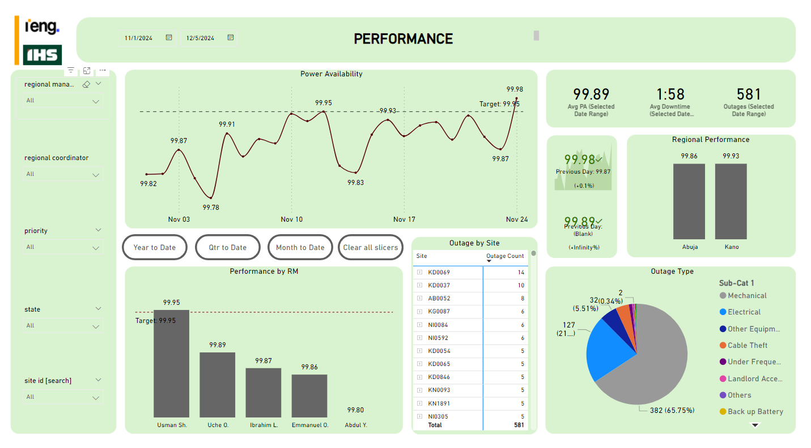
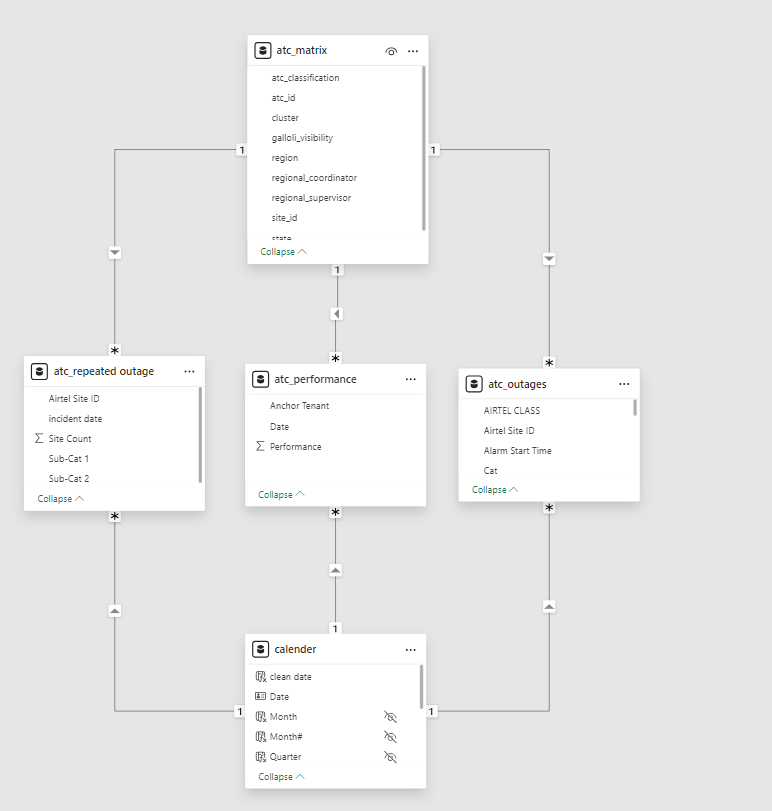

# Telecommunications Site Outages Analysis and Reporting


[Interactive Report](https://app.powerbi.com/view?r=eyJrIjoiMDM4MGJmYTctNDBjZi00ZjE4LWEzY2YtMWMxNjUzMjQwZTNhIiwidCI6ImRmODY3OWNkLWE4MGUtNDVkOC05OWFjLWM4M2VkN2ZmOTVhMCJ9)

## Table of contents

- [Objective](#objective)
- [Data Collection and Preparation](#data-collection-and-preparation)
  - [Dataset Acquisition](#dataset-acquisition)
  - [Data Cleaning](#data-cleaning)
- [Data Integration and Modeling in Power BI](#data-integration-and-modeling-in-power-bi)
  - [Loading Data into Power BI](#loading-data-into-power-bi)
  - [Creating a Calendar Table](#creating-a-calendar-table)
  - [Data Modeling](#data-modeling)
- [Measure Creation](#measure-creation)
  - [Matrix Table Measures](#matrix-table-measures)
  - [Performance Table Measures](#performance-table-measures)
  - [Outages Table Measures](#outages-table-measures)
- [Data Visualization](#data-visualization)
  - [Performance Over Time](#performance-over-time)
  - [Regional Performance](#regional-performance)
  - [Interactive Filtering](#interactive-filtering)
- [Conclusion](#conclusion)

## Objective

The goal of this project is to analyze and visualize the performance and availability of telecommunications sites over a specified period. By integrating and modeling outage data with site information and creating detailed reports, we aim to provide actionable insights into site performance and identify trends and patterns in outages.

## Data Collection and Preparation

### Dataset Acquisition

- A dataset was downloaded containing records of telecommunications site outages, including the availability of each site, measured as a percentage of each day. [Datasets](assets/datasets)

### Data Cleaning

- The raw outage data was loaded into a Pandas DataFrame for cleaning, which involved handling missing values, correcting data types, and removing any inconsistencies. [Notebook Link](assets/performance%20and%20outage%20EDA%20and%20Cleaning.ipynb)
- The cleaned data was then exported as a CSV file for further analysis.


## Data Integration and Modeling in Power BI

### Loading Data into Power BI

- The cleaned outage data CSV file was imported into Power BI.
- An additional database containing comprehensive information about the telecommunications sites was also loaded.

### Creating a Calendar Table

- A calendar table was generated in Power BI to facilitate time-based analysis of the site's performance. This table includes all the necessary dates over the period of analysis.

```DAX
CalendarTable = CALENDAR(DATE(2022,01,01), DATE(2025,12,31))
```

### Data Modeling

- The three tables (cleaned outage data, site information, and calendar table) were modeled and joined on relevant keys:
  - The outage data was joined to the site information on the "Site ID".
  - The outage data was joined to the calendar table on the "Date".


### Measure Creation

#### Matrix Table Measures

- **Percentage of Sites with Outages:**
  ```DAX
  Percentage of Sites with Outages = 
  DIVIDE(
      [Distinct Sites Count],
      [Total Sites],
      0
  )
  ```

- **Total Sites:**
  ```DAX
  Total Sites = COUNTROWS(ihs_matrix)
  ```

#### Performance Table Measures

- **Days:**
  ```DAX
  Days = COUNTROWS(DISTINCT('ihs_performance'[Date]))
  ```

#### Outages Table Measures

- **Average Downtime per Day:**
  ```DAX
  Average Downtime per Day = [Total Downtime] / [Days]
  ```

- **Converted Time:**
  ```DAX
  ConvertedTime = 
  VAR TotalMinutes = [Total Downtime]
  VAR Hours = INT(TotalMinutes / 60)
  VAR Minutes = MOD(TotalMinutes, 60)
  RETURN
  FORMAT(Hours, "00") & ":" & FORMAT(Minutes, "00")
  ```

- **Converted Time Average:**
  ```DAX
  ConvertedTime Average = 
  VAR TotalMinutes = [Average Downtime per Day]
  RETURN
  FORMAT(TIME(TotalMinutes/60, MOD(TotalMinutes, 60), 0), "hh:mm")
  ```

- **Distinct Sites Count:**
  ```DAX
  Distinct Sites Count = 
  CALCULATE(
      DISTINCTCOUNT('ihs_matrix'[IHS ID]),
      FILTER(
          'ihs_outages',
          RELATED('ihs_matrix'[IHS ID]) <> BLANK() &&
          ihs_outages[Day] >= MIN('CalendarTable'[Date]) &&
          ihs_outages[Day] <= MAX('CalendarTable'[Date])
      )
  )
  ```

- **Repeated Outages on Same Day:**
  ```DAX
  Repeated Outages on Same Day = 
  VAR CurrentRowDate = [Day]
  VAR CurrentRepeatedOutage = [Repeated Outages]
  VAR SameDayOccurrences =
      CALCULATE(
          COUNTROWS('ihs_outages'),
          FILTER(
              'ihs_outages',
              [Day] = CurrentRowDate && [Repeated Outages] = CurrentRepeatedOutage
          )
      )
  RETURN
      IF(SameDayOccurrences > 1, 1, 0)
  ```

- **Total Downtime:**
  ```DAX
  Total Downtime = SUM(ihs_outages[Hours])
  ```

## Data Visualization

### Performance Over Time

- A line chart was used to visualize site performance over time, showing trends in availability and outage occurrences.

### Regional Performance

- A bar chart was employed to display performance metrics per regional manager and clusters, allowing for a clear comparison of regional performance.

### Interactive Filtering

- Slicers were created to enable interactive filtering of the data, allowing users to focus on specific regions, site types, or time periods as needed.

## Conclusion

By integrating outage data with site information and utilizing Power BI's robust modeling and visualization capabilities, this project provides a comprehensive view of telecommunications site performance. The insights gained can be used to improve site reliability, allocate resources more effectively, and address recurring issues in a timely manner. [Click here for Interactive Power BI Report](https://app.powerbi.com/view?r=eyJrIjoiMDM4MGJmYTctNDBjZi00ZjE4LWEzY2YtMWMxNjUzMjQwZTNhIiwidCI6ImRmODY3OWNkLWE4MGUtNDVkOC05OWFjLWM4M2VkN2ZmOTVhMCJ9)
