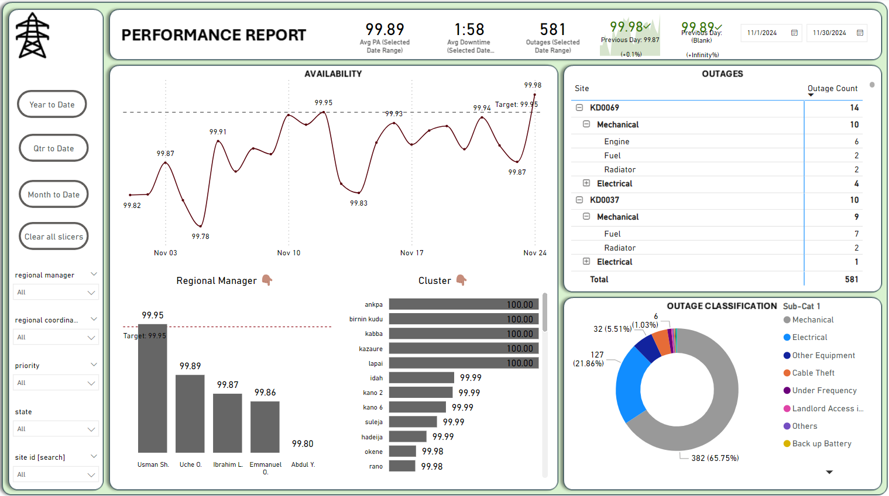

# Telecommunications Site Outages Analysis and Reporting


[Interactive Report](https://app.powerbi.com/view?r=eyJrIjoiNDhlMzNjNTYtNjVjZi00YWVkLTliZmMtMWQxOWE1MTJlMGZkIiwidCI6ImRmODY3OWNkLWE4MGUtNDVkOC05OWFjLWM4M2VkN2ZmOTVhMCJ9)  

## Table of contents

- [Objective](#objective)
- [Data Collection and Preparation](#data-collection-and-preparation)
  - [Dataset Acquisition](#dataset-acquisition)
  - [Data Cleaning](#data-cleaning)
- [Data Integration and Modeling in Power BI](#data-integration-and-modeling-in-power-bi)
  - [Loading Data into Power BI](#loading-data-into-power-bi)
  - [Creating a Calendar Table](#creating-a-calendar-table)
  - [Data Modeling](#data-modeling)
- [Measure Creation](#measure-creation)
  - [Matrix Table Measures](#matrix-table-measures)
  - [Performance Table Measures](#performance-table-measures)
  - [Outages Table Measures](#outages-table-measures)
- [Data Visualization](#data-visualization)
  - [Performance Over Time](#performance-over-time)
  - [Regional Performance](#regional-performance)
  - [Interactive Filtering](#interactive-filtering)
- [Conclusion](#conclusion)

## Objective

The goal of this project is to analyze and visualize the performance and availability of telecommunications sites over a specified period. By integrating and modeling outage data with site information and creating detailed reports, we aim to provide actionable insights into site performance and identify trends and patterns in outages.

## Data Collection and Preparation

### Dataset Acquisition

- A dataset was downloaded containing records of telecommunications site outages, including the availability of each site, measured as a percentage of each day. [Datasets](assets/datasets)

### Data Cleaning

- The raw outage data was loaded into a Pandas DataFrame for cleaning, which involved handling missing values, correcting data types, and removing any inconsistencies. [Notebook Link](assets/ETL_Performance.ipynb)
- The cleaned data was then exported as a CSV file for further analysis.


## Data Integration and Modeling in Power BI

### Loading Data into Power BI

- The cleaned outage data CSV file was imported into Power BI.
- An additional database containing comprehensive information about the telecommunications sites was also loaded.

### Creating a Calendar Table

  A calendar table was generated in Power BI to facilitate time-based analysis of the site's performance. This table includes all the necessary dates over the period of analysis. Table is also dynamic, so that end date is always "today"
  The Year, Quater, Month columns are also created

```DAX
calender = CALENDAR(DATE(2022,01,01),TODAY())

Year = 
YEAR(calender[Date]
)

Quarter = 
"Qtr" & QUARTER(calender[Date])

Month Name = 
FORMAT(
    DATE(
        1,
        'calender'[Month#],
        1
    ),
    "mmmm"
)

Month# = 
FORMAT(MONTH([Date]), "00")

Month = CONCATENATE([Month#],[Month Name])
```

### Data Modeling

- The four tables (cleaned outage and performance data, site information, and calendar table) were modeled and joined on relevant keys:
  - The outage and performance data was joined to the site information on the "Site ID".
  - The outage and performance data was joined to the calendar table on the "Date".
  - Only "One to Many (1:*)" cardinality is used
  - A Repeated Outages table was also created
```DAX
atc_repeated outage = 
SUMMARIZE(
    atc_outages,
    atc_outages[incident date],
    atc_outages[Airtel Site ID], 
    atc_outages[Sub-Cat 1],
    atc_outages[Sub-Cat 2], 
    "Site Count", COUNT(atc_outages[Airtel Site ID])
)
```


### Measure/Column Creations on Cleaned Data
  This section outlines the measures and columns created on the cleaned data for analysis. The calculations use DAX (Data Analysis Expressions) to derive insights from the data.

- **Average Performance:**
  This measure calculates the average performance across all selected filters, providing a quick snapshot of overall performance levels.
```DAX
average performance atc = 
AVERAGE(atc_performance[Performance])
```

- **Average Downtime:**
  This measure calculates average downtime by converting total outage minutes into formatted hours and minutes.
```DAX
AverageDowntime_atc = 
VAR TotalMinutes = SUM(atc_outages[DURATION]) / [Total Outages_atc]
VAR Hours = INT(TotalMinutes / 60)
VAR Minutes = MOD(ROUND(TotalMinutes, 0), 60)
RETURN
Hours & ":" & FORMAT(Minutes, "00")
  ```

- **Dynamic Performance:**
  This measure dynamically calculates the average performance of the selected ATC records using the AVERAGEX function, ensuring it reflects the context and scope defined by ALLSELECTED.
```DAX
  Dynamic PA ATC = 
AVERAGEX(
    ALLSELECTED(atc_performance),
    atc_performance[Performance]
)
  ```

- **Latest Performance:**
  This measure calculates the average performance for the most recent date in the atc_performance table using the average performance atc measure. It finds the latest date and applies the average calculation for that specific date.
```DAX
  Latest Date Performance (atc) = 
CALCULATE(
    [average performance atc],
    LASTDATE(atc_performance[Date])
)
  ```

- **Worst Sites:**
  This measure calculates the worst-performing sites by selecting the top 10 sites with the lowest average performance. It uses TOPN to filter the top 10 worst performers in the atc_performance table and applies the average performance atc measure within the current context defined by RankingContext
```DAX
Worst Sites = 
VAR RankingContext = VALUES(atc_matrix[site_id])
RETURN
    CALCULATE(
        [average performance atc],
        TOPN(10, 
            ALL(atc_performance[Anchor Tenant]), 
            [average performance atc], 
            ASC
        ),
        RankingContext
    )

  ```

### Additional notes
- Average Performance: Helps quickly gauge the overall performance based on selected filters, allowing for immediate insights into performance trends.
- Total Outages: Useful for understanding the frequency and volume of outages, essential for operational and performance analysis.
- Checking for Repeated Outages: This measure is crucial for identifying systemic issues or recurring problems that may need attention.
- Total Repeated Outages: Summarizes repeated outages to help quantify the impact of recurring issues.
- Average Downtime: Provides a clear view of the average time to repair, which is essential for assessing maintenance efficiency and responsiveness.
- Site Count: Offers a straightforward count of the sites being managed, which can be useful for capacity planning and resource allocation.


## Data Visualization on Power BI

### Performance Over Time

- A line chart was used to visualize site performance over time, showing trends in availability, A constant line is also included to show target
- A clustered bar chart is used to show outages in compparison to repeated outages over same period

### Regional Performance

- A bar chart was employed to display performance metrics per regional manager and clusters, allowing for a clear comparison of regional performance.

### Interactive Filtering

- Slicers were created to enable interactive filtering of the data, allowing users to focus on specific regions, site types, or time periods as needed.

## Conclusion

By integrating outage data with site information and utilizing Power BI's robust modeling and visualization capabilities, this project provides a comprehensive view of telecommunications site performance. The insights gained can be used to improve site reliability, allocate resources more effectively, and address recurring issues in a timely manner. [Click here for Interactive Power BI Report](https://app.powerbi.com/view?r=eyJrIjoiNDhlMzNjNTYtNjVjZi00YWVkLTliZmMtMWQxOWE1MTJlMGZkIiwidCI6ImRmODY3OWNkLWE4MGUtNDVkOC05OWFjLWM4M2VkN2ZmOTVhMCJ9)
